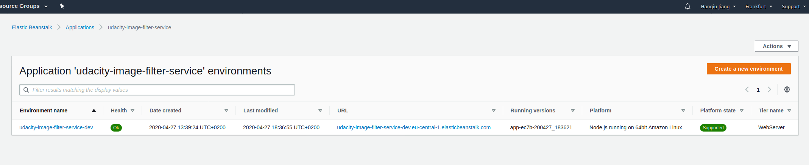

# Udagram Image Filtering Microservice

This Image Filtering Microservice is a Node-Express application which runs a simple script to process images.
The starter code is taken from https://github.com/udacity/cloud-developer/tree/master/course-02/project/image-filter-starter-code

### Local server

You'll need to create a new node server. Open a new terminal within the project directory and run:

1. Initialize a new project: `npm i`
2. run the development server with `npm run dev`

### Cloud server
AWS endpoint: http://udacity-image-filter-service-dev.eu-central-1.elasticbeanstalk.com

Try a GET request to:
http://udacity-image-filter-service-dev.eu-central-1.elasticbeanstalk.com/filter/?image_url={{your_image_url}}

